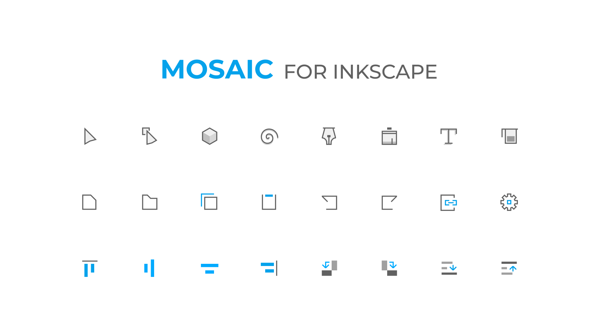

# Mosaic

## About

Mosaic is a modern icon replacement for Inkscape 1.2.x, which is designed based on [Minimal icons by 7k](https://gitlab.com/7kv929/minimal-icon-for-inkscape).

## Installation

1. Download and extract zip file

2. Copy Mosaic folder to Inkscape user icons path
   for Linux/MacOS users : ~/.config/inkscape/icons/
   for Windows users : C:\Program Files\Inkscape\share\icons\

   You can find Inkscape user icon path from Edit > Preferences > Interface > Theming > User Icons

3. Restart Inkscape and form Edit > Preferences > Interface > Theming > Change icon theme, Choose Mosaic
